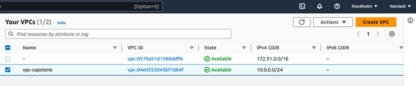
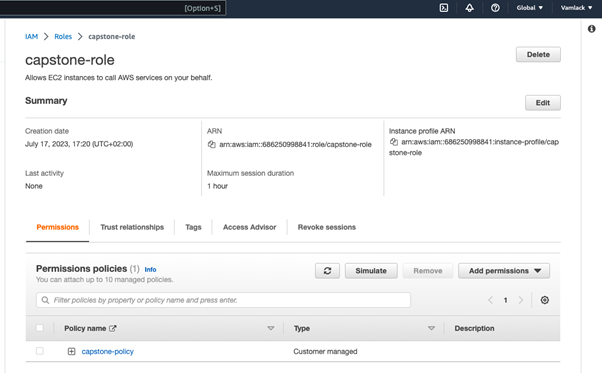
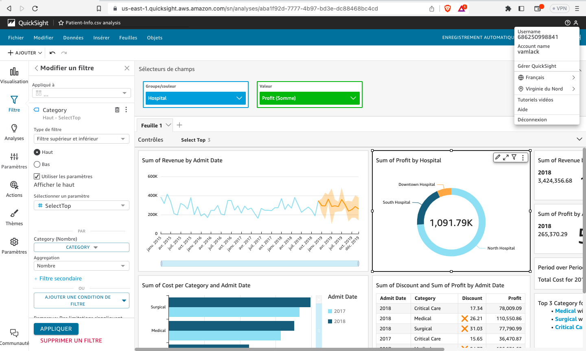
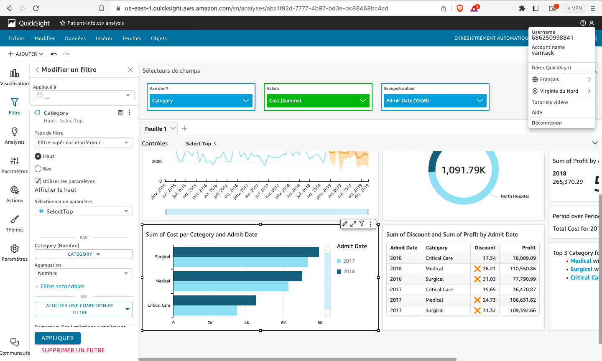
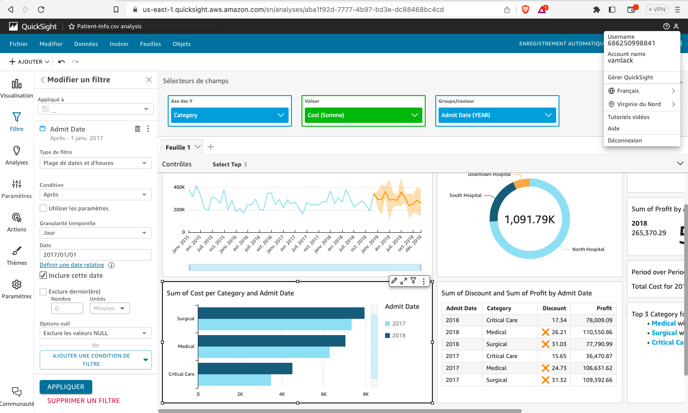
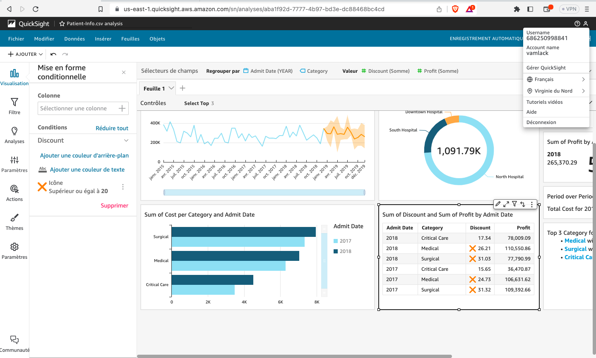
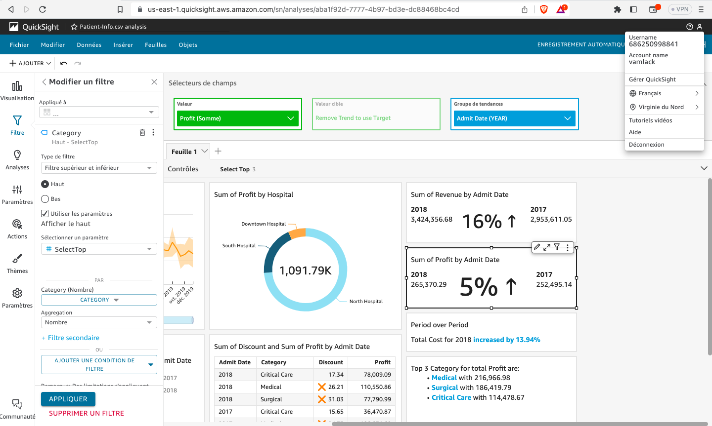
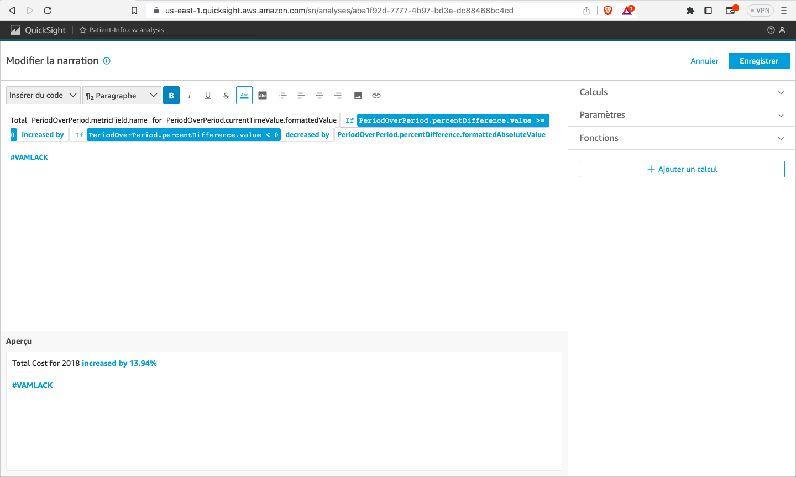

# AWS Cloud & Big Data Architectures Capstone Project
---

Table of Contents

[1. AWS Cloud - The Website](#awscloud)  
[2. Quizz](#quizz)  
[3. IAM policies](#iam)  
[4. Big Data - Data Visualization With AWS QuickSight](#bigdata)  

---

  
# 1. AWS Cloud - The Website

 
 

  

  
# 2. Quizz

## IAM quizz
1. Option 3 
2. Option 1
3. Option 3 & 4
4. Option 1
5. Option 1
6. Option 3
7. Option 1

## Network quizz
1. Option 3 
2. Option 3
3. Option 1, 3 & 6
4. Option 3 
  

  
# 3. IAM

**Question 1: What actions are allowed for EC2 instances and S3 objects based on this policy? What specific resources are included?**  
Based on the provided policy, the following actions are allowed : 
For EC2 instances :  
``ec2:RunInstances:`` Allows the user to launch new EC2 instances.  
``ec2:TerminateInstances:`` Allows the user to terminate EC2 instances.  
For S3 objects :  
``s3:GetObject:`` Allows the user to retrieve (read) objects from an S3 bucket.
``s3:PutObject:`` Allows the user to upload (write) objects to an S3 bucket.
  
The policy includes the following specific resources: 
For EC2 instances : 
``arn:aws:ec2:us-east-1:123456789012:instance/*`` : This specifies all EC2 instances in the us-east-1 region under the AWS account 123456789012. The * indicates that the policy applies to all instances under that account and region. 
 
For S3 instances :  
``arn:aws:s3:::example-bucket/*`` : This specifies all objects within the S3 bucket named example-bucket. The * indicates that the policy applies to all objects within that bucket.
  

**Question 2: Under what condition does this policy allow access to VPC-related information? Which AWS region is specified?**  
This policy allows access to VPC-related information under the condition that the aws:RequestedRegion value is equal to "us-west-2". The specified AWS region is "us-west-2".
  

**Question 3: What actions are allowed on the "example-bucket" and its objects based on this policy? What specific prefixes are specified in the condition?**  
Based on this policy, the following actions are allowed on the "example-bucket" and its objects:  
``s3:GetObject:`` Allows retrieving (reading) objects from the "example-bucket".  
``s3:PutObject:`` Allows uploading (writing) objects to the "example-bucket".  
``s3:ListBucket:`` Allows listing the objects within the "example-bucket".  

The policy specifies the following prefixes in the condition:  
``documents/*:`` This prefix specifies that objects within the "example-bucket" under the "documents" directory or folder are included in the allowed actions. For example, objects with keys like "documents/file1.txt" or "documents/subfolder/file2.txt" would match this prefix.  
``images/*:`` This prefix specifies that objects within the "example-bucket" under the "images" directory or folder are included in the allowed actions. For example, objects with keys like "images/photo.jpg" or "images/subfolder/image.png" would match this prefix.  
The policy allows the specified actions on any object within the "example-bucket" that matches either the "documents/" or "images/" prefix.
  

**Question 4: What actions are allowed for IAM users based on this policy? How are the resource ARNs constructed?**  
Based on this policy, the following actions are allowed for IAM users:  
``iam:CreateUser:**`` Allows creating new IAM users.  
``iam:DeleteUser:**`` Allows deleting existing IAM users.  

The resource ARNs in this policy are constructed using the ${aws:username} variable. 
The ${aws:username} variable is a placeholder that will be dynamically replaced with the actual username of the IAM user during the evaluation of the policy. 
It allows the policy to apply to the specific IAM user who is making the request.  
The resource ARN for both statements in the policy is ``arn:aws:iam::2546542454567:user/${aws:username}``  
In this ARN, 2546542454567 represents the AWS account ID, and ${aws:username} is the placeholder for the IAM user's username.
  

**Questions 5-1: Which AWS service does this policy grant you access to?**  
This policy grants access to the AWS Identity and Access Management (IAM) service.
  

**Questions 5-2: Which AWS service does this policy grant you access to?**  
While this policy allows various iam:Get* and iam:List* actions, it does not explicitly grant permissions to create an IAM user, group, policy, or role.  
The actions specified in this policy are focused on retrieving (getting) and listing IAM-related information and resources, such as users, groups, policies, roles, access keys, and more. To create an IAM user, group, policy, or role, additional iam:Create* or specific actions for creation would need to be included in the Action field of the policy statement.
  

**Questions 5-3: Name at least three specific actions that the iam:Get action allows.**  
``iam:GetUser:`` Grants permission to retrieve information about the specified IAM user, including user's creation date, path, unique ID, and ARN.  
``iam:GetRole:`` Grants permission to retrieve information about the specified role, including role's path, GUID, ARN, and the role's trust policy.  
``iam:GetPolicy:`` Grants permission to retrieve information about the specified managed policy, including the policy's default version.  
``iam:GetGroup:`` Grants permision to the user to retrieve information about a specific IAM group, including its name, path, unique ID, and ARN. 
  

**Questions 6-1: Which AWS service does this policy grant you access to?**  
Based on this policy, the policy allows the following actions:  
``ec2:RunInstances:`` Allows launching new EC2 instances.  
``ec2:StartInstances:`` Allows starting existing EC2 instances.  
However, there is a Deny effect specified in the policy, which means that these actions are denied under certain conditions. The policy denies the ec2:RunInstances and ec2:StartInstances actions when the ec2:InstanceType condition matches "t2.micro" or "t2.small".  
This means that the policy is preventing the launch and start of EC2 instances with the instance types of t2.micro or t2.small.
  

**Questions 6-2: How would the policy restrict the access granted to you by this additional statement?**  
The additional statement with the following configuration, will override the previous Deny effect for the ec2:* actions :  
<pre>{
    "Effect": "Allow",
    "Action": "ec2:*"
}</pre>
This means that the ec2:* actions, which encompass all EC2 actions, will be allowed without any restrictions. As a result, the Deny effect specified in the previous statement will not restrict access to any EC2 actions.
  

**Questions 6-3: If the policy included both the statement on the left and the statement in question 2, could you terminate an m3.xlarge instance that existed in the account?**  
The provided policy allows all actions on all EC2 instances without imposing any restrictions on terminating instances. Therefore, you would be able to terminate an m3.xlarge instance if it exists in the account.
  

  
# 4. Big Data - Data Visualization With AWS QuickSight

Global view  
   

Sum of Revenue by Admit Date  
   

Sum of Profit by Hospital  

Sum of Cost per Category and Admit Date  

   

Sum of Discount and Sum of Profit by Admit Date  

   

Sum of Revenue by Admit Date  

   

Sum of Profit by Admit Date  

   

Period over Period  
 
   

Top 3 Category for total Profit are :  

   
